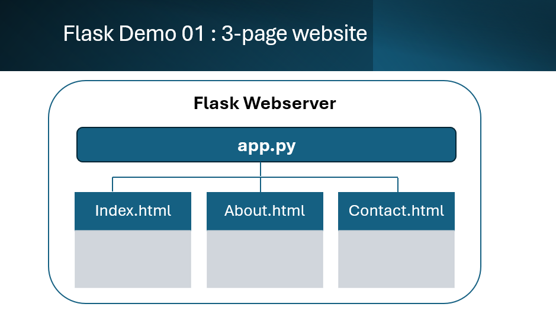

# Flask for Beginners

This repo is made up of several folders demonstrating how to build a website application using Flask.

Flask is a micro-framework that runs a local internet webserver on your computer. When the <code>FLASK run</code> command is issued, Flask starts a local webserver, typically, with the IP address of 127.0.0.1 on port :5000.

With the Flask server running entering the URL <code>127.0.0.1:5000</code> directs the browser to a default html file you specify.

The Flask server is a 'web app'. It needs an initial program that will be always running while the Flask webserver is running. This program sits in the background and listens out for browsers trying to connect to the Flask server. In these examples we use Python as the initial program. Following Flask conventions this program will be named <code>app.py</code>

Entering the URL <code>127.0.0.1:5000</code> opens the default .html webpage you specify.

## FlaskDemo01_1 : Basic coding skills

Build a simple 3-page website using HTML, CSS and a little Python

## FlaskDemo01_2 : Basic coding skills

Improve the 3-page website using a template applied across all 3 pages

## FlaskDemo02 : Intermediate coding skills

Build a website that creates HTML content from JavaScript lists

## FlaskDemo03 : Advanced coding skills

Build a website that creates HTML content from a local SQL database server

    - HTML, CSS
    - Python
    -- string manipulation
    -- accessing SQL server
    -- creating text files (File I/O)
    - SQL
    -- SQL SELECT statement
    -- a local SQL server, such as MariaDB, MySQL etc
